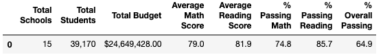
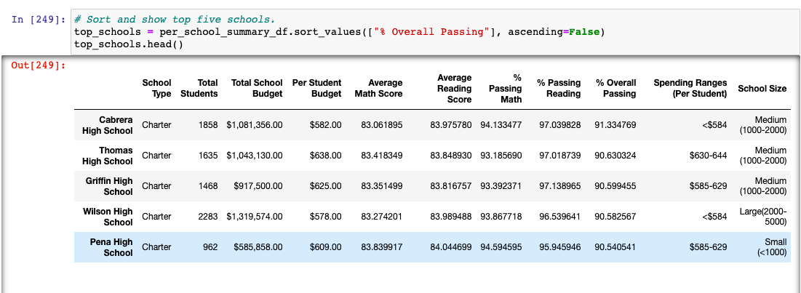
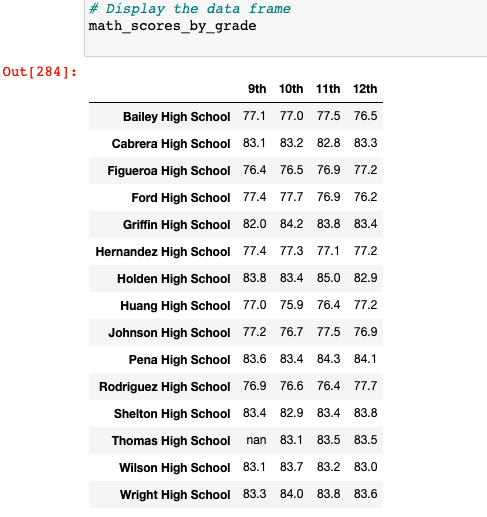
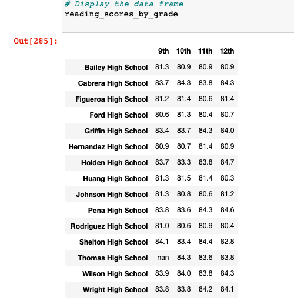

# School_District_Analysis

## Overview of the Analysis:

The main goal of this project was to aggravate the data and show the trends occurring in school performance, specifically analyzing student funding and student standardized test scores. This analysis is suppose to help the school board and super intendent make informed decisions based on the school's budget and priorities. The repeat of the school district analysis was completed to investigate possible academic dishonesty from Thomas High school' ninth graders.

## Results

### How is the district summary affected?

When reevaluating the average scores and passing percentages within the fifteen schools in the district, shifts were discovered. The average math  score dropped by .1; the passing math, reading, and overall passing percentage dropped by 1%. The only score that remained the same was the average reading score.

### How is the school summary affected?

* Thomas High Schoolkept their second place position in the top 5 schools
* Previously having a 90.94% overall passing score
* Dropping to only 90.63%

### How does replacing the ninth_grade scores affect the following:

#### Math and Reading Scores by Grade:

* Data replacement did not affect the math and reading scores by grade
* It clearly shows "NaN" where the ninth grade at Thomas High School grades were not included to clean the data

